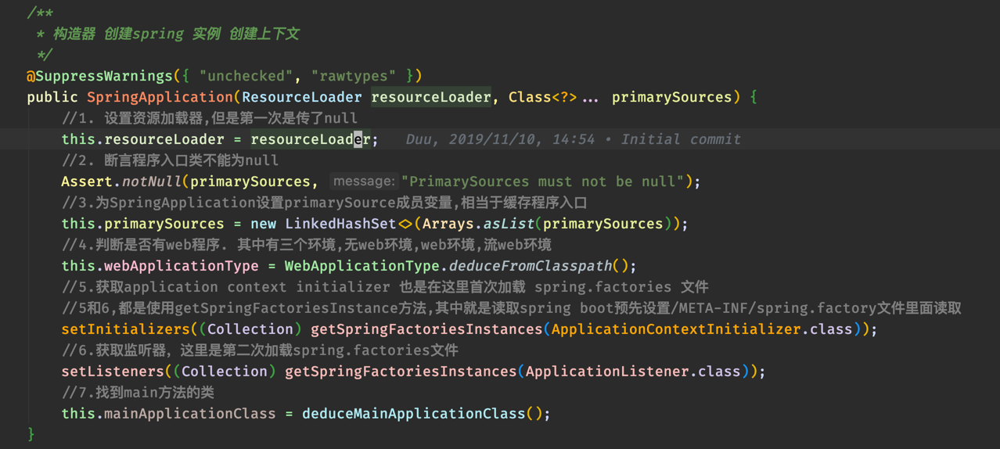
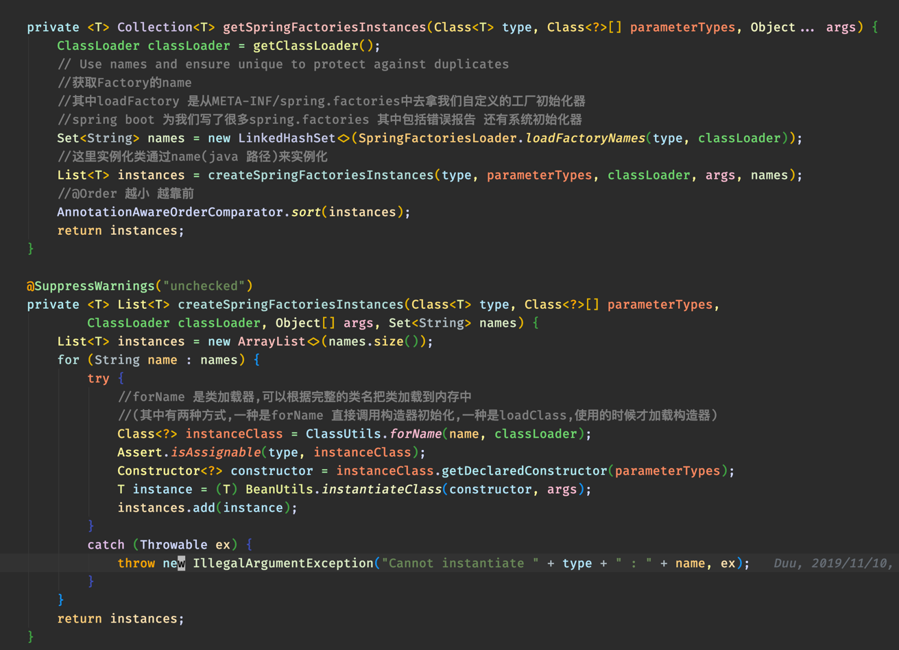
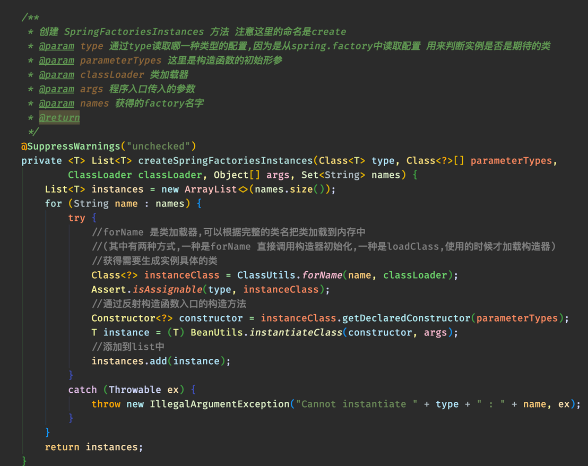

# spring 源代码阅读笔记

## spring boot初始化流程

### 其中最主要的的是getSpringFactoriesInstances方法
* 通过源码的解读我们知道了,Spring这里的命名原则是
   * getSpringFactoriesInstances => createSpringFactoriesInstances
    
   * 其中主要实现如下图所示
     
   
   

